# inference-bros

A Kubernetes-based platform for selling AI inference services. This infrastructure runs on bare-metal servers and deploys language models that customers can access via API.

## 1. Purpose

This platform allows you to:
- Deploy and serve AI language models (like Qwen, Llama, etc.) on your own hardware
- Manage customer access and billing through Bifrost gateway
- Monitor usage and generate invoices automatically via Odoo integration
- Provide OpenAI-compatible API endpoints for easy integration

## 2. Hardware Requirements

### Production/Staging Servers
- **Operating System:** Debian 13 (trixie)
- **Access:** Root SSH access with your public key already trusted
- **GPU Drivers:** Pre-installed (if using GPUs for model inference)
- **Networking:** Static IPs configured on same LAN
- **Minimum Servers:** 1 or more (3+ recommended for HA)
- **Software:** NAS S3 server or another PC with Minio installed - for offsite backup. Central server, all locations will back up here.

### Network IP Requirements
You'll need at least 2 free IPs on your LAN subnet:
- **kube_vip IP** - Virtual IP for high-availability Kubernetes API (e.g., 192.168.1.252)
- **MetalLB NGINX IP** - LoadBalancer IP for all web services (e.g., 192.168.1.240)

**IP Explanation:**
- **Server IPs** - Each physical server's static IP on your LAN
- **kube_vip** - Floats between master nodes for K3s API redundancy
- **MetalLB NGINX** - Single IP where all ingress traffic lands (Grafana, Bifrost, etc.)

### Public Access (Production)
For production deployments, you need a public IP with port forwarding:
- SSH (2201, 2202, etc. → server port 22)
- HTTPS (443 → MetalLB NGINX IP)
- K3s API (6443 → kube_vip IP)
- Minio (9000-9001 -> NAS port 9000-9001) for backups

### GPU Installation Notes
**NVIDIA on Debian:**
https://github.com/mexersus/debian-nvidia-drivers

For older cards (1050Ti): https://us.download.nvidia.com/XFree86/Linux-x86_64/580.126.09/NVIDIA-Linux-x86_64-580.126.09.run

## 3. Installed Software & Links

### Software Stack

**Core Infrastructure:**
- **K3s** - Lightweight Kubernetes distribution
- **Kube-VIP** - High availability for K3s masters
- **MetalLB** - LoadBalancer services for bare-metal
- **Longhorn** - Persistent volume management (optional, enables model caching)
- **NVIDIA/AMD GPU Operators** - Automatically installed if GPUs are detected

**Networking & Security:**
- **ingress-nginx** - HTTP(S) routing and load balancing
- **cert-manager** - SSL certificates (Let's Encrypt + self-signed)
- **Dex** - Identity provider (OIDC authentication)
- **oauth2-proxy** - Authentication proxy for internal UIs

**AI & Gateway:**
- **KubeAI** - Model serving orchestration (supports VLLM/Ollama runners)
- **Bifrost** - LLM gateway with billing, governance, and customer management

**Monitoring Stack (optional):**
- **Prometheus** - Metrics collection and storage
- **Grafana** - Monitoring dashboards and visualization
- **Loki** - Log aggregation
- **Tempo** - Distributed tracing
- **Alertmanager** - Alert routing to Slack

**Management UIs:**
- **Headlamp** - Kubernetes dashboard for cluster management
- **Longhorn UI** - Storage management interface
- **PVC Explorer** - Browse model cache contents
- **VUI** - Velero management for backups

### Service URLs & Access

**Live Deployments (Stalpeni Example):**

All services follow the pattern: `https://{service}.{location}.inferencebros.com`

- `k3s.stalpeni.inferencebros.com:6443` - Kubernetes API
- `dex.stalpeni.inferencebros.com` - Identity provider (OIDC)
- `oauth2-proxy.stalpeni.inferencebros.com` - Authentication proxy
- `headlamp.stalpeni.inferencebros.com` - Kubernetes management dashboard
- `grafana.stalpeni.inferencebros.com` - Monitoring & dashboards
- `prometheus.stalpeni.inferencebros.com` - Metrics collection
- `alertmanager.stalpeni.inferencebros.com` - Alert management
- `longhorn.stalpeni.inferencebros.com` - Storage management
- `bifrost.stalpeni.inferencebros.com` - LLM gateway & customer management
- `models.stalpeni.inferencebros.com` - Model storage browser
- `control.stalpeni.inferencebros.com` - Invoicing & usage API
- `vui.stalpeni.inferencebros.com` - Velero UI - backup solution

**Available Locations:**
- **local** - Development environment
- **stalpeni** - Production environment in Romania
- **pr** - Preview/staging environment

Each location is completely independent with its own domain, user accounts, customer database, billing, and model deployments.

## 4. How to Use

### Connecting to the Cluster

Before you can deploy models or manage the platform, you need to connect to the K3s cluster. There are several ways to do this:

**Option 1: Use Hosted Headlamp (Easiest)**
- Navigate to `https://headlamp.{location}.inferencebros.com`
- Authenticate via Dex/OAuth2
- Manage resources directly in the web UI

**Option 2: Local kubectl Access**

1. **Get the kubeconfig:**
   - Go to https://app.terraform.io/app/inference-bros/workspaces
   - Select your workspace → Latest State → View
   - Copy `k3s_kubeconfig_for_users` from the JSON
   
2. **Save the kubeconfig:**
   ```bash
   # Save to default location
   mkdir -p ~/.kube
   # Paste the kubeconfig content to ~/.kube/config
   ```

3. **Install required tools:**
   - **kubectl:** Kubernetes command-line tool
   - **int128/kubelogin:** OIDC authentication plugin
     - Download from: https://github.com/int128/kubelogin/releases
     - Rename executable to `kubectl-oidc_login`
     - Place in your PATH (e.g., `/usr/local/bin/`)

4. **Install a cluster management tool (optional):**
   - **Lens (Freelens):** Desktop Kubernetes IDE - https://k8slens.dev/
   - **k9s:** Terminal-based cluster manager - https://k9scli.io/

5. **Test your connection:**
   ```bash
   kubectl get nodes
   # This will trigger OIDC login via browser
   ```

### Deploying Models

Use the **Headlamp dashboard** to create Model resources. All models require the `openrouter.ai/json` annotation for API discovery and pricing.

**Reference Documentation:**
- [KubeAI Model CRD Specification](https://github.com/kubeai-project/kubeai/blob/main/docs/reference/kubernetes-api.md)

**Available Resource Profiles:**
- `nvidia-unlimited` - Modern NVIDIA GPUs (RTX 20xx+)
- `nvidia-older-unlimited` - Pascal architecture GPUs (GTX 10xx)
- `cpu-unlimited` - Generic CPU inference
- `cpu-avx2-unlimited` - CPUs with AVX2 support
- `amd-unlimited` - All AMD GPUs

**Supported Model Runners:**
- **VLLM** - Recommended for production (supports model caching with Longhorn)
- **Ollama** - Alternative runner

#### Example: QWEN 2.5-0.5B-Instruct

```yaml
apiVersion: kubeai.org/v1
kind: Model
metadata:
  annotations:
    openrouter.ai/json: |
      {
        "id": "qwen25-05b-instruct",
        "hugging_face_id": "Qwen/Qwen2.5-0.5B-Instruct",
        "name": "Qwen2.5-0.5B-Instruct",
        "created": 1690502400,
        "input_modalities": ["text"],
        "output_modalities": ["text"],
        "quantization": "bf16",
        "context_length": 4096,
        "max_output_length": 1024,
        "pricing": {
          "prompt": "0.000008",
          "completion": "0.000024",
          "image": "0",
          "request": "0",
          "input_cache_read": "0",
          "input_cache_write": "0"
        },
        "supported_sampling_parameters": ["temperature", "stop"],
        "supported_features": [
          "tools",
          "json_mode",
          "structured_outputs"
        ],
        "description": "Qwen's most used model",
        "openrouter": {
          "slug": "inferencebros-local/qwen25-05b-instruct"
        },
        "datacenters": [
          {
            "country_code": "RO"
          }
        ]
      }
  name: qwen25-05b-instruct
  namespace: kubeai
spec:
  engine: VLLM # or OLlama
  # For VLLM, use args:
  args:
    - "--gpu-memory-utilization=0.85"
    - "--dtype=half"
    - "--enforce-eager"
    - "--max-model-len=2048"
  ##################################
  features:
    - TextGeneration
  minReplicas: 1
  maxReplicas: 1
  # replicas: 1 # pin replicas
  resourceProfile: nvidia-older-unlimited:1 # Add :1 suffix to resource profile
  url: hf://Qwen/Qwen2.5-0.5B-Instruct # For Ollama use: ollama://hf.co/Qwen/Qwen2.5-0.5B-Instruct-GGUF:qwen2.5-0.5b-instruct-q4_k_m.gguf
  cacheProfile: storage # VLLM only, requires Longhorn for ReadWriteMany support
```

**Important Notes:**
- Model caching (`cacheProfile: storage`) is only supported with VLLM
- Only use `cacheProfile` if Longhorn is installed
- Full openrouter.ai/json schema documentation available in original KubeAI docs

### Customer Management via Bifrost

**Adding New Customers:**

1. Navigate to Bifrost portal: `https://bifrost.{location}.inferencebros.com`
2. Go to **Governance > Users & Groups > Customers**
3. Click **Add Customer** and fill in customer details
4. Navigate to **Governance > Virtual Keys**
5. Click **Create New Key**:
   - Link it to the customer you just created
   - Copy the generated API key for the customer

**Testing Customer Access with Cherry Studio:**

1. Install **Cherry Studio**: https://www.cherry-ai.com/download
2. Open Cherry Studio and navigate to **Settings > Model Provider**
3. Disable all existing providers
4. Click **Add New Provider**:
   - Type: `openai`
   - URL: `https://bifrost.{location}.inferencebros.com`. For local it should be `http://bifrost-insecure.local.inferencebros.com`.
   - API Key: Paste the key from Bifrost
5. Click **Manage Models** and select available models
6. Start chatting to test the deployment!

### Control Module APIs

The control service exposes a GUI at `/` and several APIs at `control.{location}.inferencebros.com`:

**Public Endpoints:**
- `/openrouter/models` - List all available models with pricing
- `/bifrost/pricingSheet` - Current pricing information

**Authenticated Endpoints** (require API key in Authorization header):
- `/usage?start_date=<ISO>&end_date=<ISO>` - Query usage statistics for date range
- `/invoicing/generate?date=<ISO>&dry_run=<all|validate|none>` - Manual invoice generation
  - `dry_run=all` - Skip all Odoo operations (test mode)
  - `dry_run=validate` - Check for duplicate invoices only
  - `dry_run=none` - Full run with Odoo sync (default)

**Automatic Invoicing:**
- Runs automatically on the 2nd of each month at 00:00 UTC
- Bills for the previous complete calendar month
- Automatically syncs invoices to Odoo and emails customers

### Monitoring & Alerts

**Grafana Dashboard:**
- Access: `https://grafana.{location}.inferencebros.com`
- Pre-configured dashboards for:
  - Model inference metrics (requests/sec, latency, tokens/sec)
  - GPU utilization and memory
  - Customer usage patterns
  - Billing and revenue tracking
  - Kubernetes cluster health

**Bifrost Portal Monitoring:**
- Access: `https://bifrost.{location}.inferencebros.com`
- Real-time customer usage
- API key management and rotation
- Rate limiting and quota monitoring

**AlertManager to Slack:**
- Critical alerts automatically sent to Slack workspace

## 5. How to Develop

### Developer Hardware Requirements

- **Development Machine:** Debian 13 on your LAN (can be a VM with Network mode = bridge)
- **SSH Access:** SSH key from Google Drive added as trusted on dev machine
- **Network:** Same LAN as your development server(s)
- **Local Access:** Ability to edit `/etc/hosts` file

### Developer Software Requirements

- **Terraform:** Latest version
- **VSCode:** Recommended IDE with extensions:
  - HashiCorp Terraform
  - Kubernetes
  - YAML
- **kubectl:** Kubernetes command-line tool
- **Git:** For version control
- **SSH Client:** For server access

### Developer Setup Steps

#### Step 1: Prepare Secret Files
Download `terraform.tfvars` from Google Drive (see section 6: External Accounts) and place it in the repo root directory.

#### Step 2: Configure Development Server
- Ensure your Debian 13 machine has the Google Drive SSH key added as trusted
- Note the machine's static IP address (e.g., 192.168.1.100)
- Update `terraform.tfvars` with:
  - Server IP address
  - kube_vip IP (e.g., 192.168.1.252)
  - MetalLB NGINX IP (e.g., 192.168.1.240)
  - Other network settings for your LAN

#### Step 3: Configure Local DNS
Edit `/etc/hosts` on your development machine:

```
192.168.1.252 k3s.local.inferencebros.com
192.168.1.240 dex.local.inferencebros.com
192.168.1.240 oauth2-proxy.local.inferencebros.com
192.168.1.240 headlamp.local.inferencebros.com
192.168.1.240 grafana.local.inferencebros.com
192.168.1.240 alertmanager.local.inferencebros.com
192.168.1.240 prometheus.local.inferencebros.com
192.168.1.240 longhorn.local.inferencebros.com
192.168.1.240 control.local.inferencebros.com
192.168.1.240 models.local.inferencebros.com
192.168.1.240 bifrost.local.inferencebros.com
192.168.1.240 vui.local.inferencebros.com
```

#### Step 4: Deploy Infrastructure

```bash
cd src/terraform
terraform plan
terraform apply
```

#### Step 5: Get Cluster Access

After deployment, retrieve your kubeconfig:

```bash
terraform output k3s_kubeconfig_for_users
```

Save this kubeconfig to `~/.kube/config` or use with `KUBECONFIG` environment variable. Then follow the "Connecting to the Cluster" instructions in section 4 to install kubectl-oidc_login and test your connection.

## 6. External Accounts & Tools

**Google Drive (Secret Files):**
- https://drive.google.com/drive/folders/1M8WCE3i4FGNXZ1uMWLwcyquWPW4AF9pN
- Contains: `terraform.tfvars`, SSH keys, and other sensitive configuration files

**Terraform Cloud (Infrastructure State):**
- https://app.terraform.io/app/inference-bros/workspaces
- Manages infrastructure state for all environments
- Access workspace state files to retrieve kubeconfig

**CloudFlare (DNS Management):**
- https://dash.cloudflare.com/f159b7db29dec75259ced7d4ad1c4a18/inferencebros.com
- Manages DNS records for `inferencebros.com`
- Configure SSL/TLS settings and subdomain routing

**Slack (Alerts & Notifications):**
- https://inferencebros.slack.com/
- Receives alerts from AlertManager
- Channels for monitoring, incidents, and billing notifications

**Odoo (Invoicing System):**
- https://inferencebros.odoo.com/odoo
- Automated invoice generation and customer billing
- Syncs with Control module for usage-based billing

**Minio (S3 NAS):**
- http://inferencebros-stalpeni.go.ro:9000
- Central backup location

---


## Architecture

```mermaid
graph TB
    WAN[WAN] --> Router
    Router -->|L2| MetalLB
    Router -->|L2| KubeVIP[KUBE-VIP]
    
    MetalLB -->|LB| IngressNGINX[INGRESS-NGINX]
    
    %% Ingress Routes
    IngressNGINX -->|SSL| BitFrost[BIFROST]
    IngressNGINX -->|SSL| Headlamp[HEADLAMP]
    IngressNGINX -->|SSL| AlertManager[ALERTMANAGER]
    IngressNGINX -->|SSL| Prometheus[PROMETHEUS]
    IngressNGINX -->|SSL| Grafana[GRAFANA]
    IngressNGINX -->|SSL| Control[CONTROL]
    IngressNGINX -->|SSL| Longhorn[LONGHORN UI]
    IngressNGINX -->|SSL| VUI[VUI]
    IngressNGINX -->|SSL| ModelsExplorer[MODELS EXPLORER]
    IngressNGINX -->|SSL| Dex[DEX]
    IngressNGINX -->|SSL| OAuth2Proxy[OAUTH2-PROXY]
    
    %% OAuth2 Protection
    OAuth2Proxy -->|OIDC| Dex
    OAuth2Proxy -.->|PROTECT| BitFrost
    OAuth2Proxy -.->|PROTECT| Headlamp
    OAuth2Proxy -.->|PROTECT| AlertManager
    OAuth2Proxy -.->|PROTECT| Prometheus
    OAuth2Proxy -.->|PROTECT| Longhorn
    OAuth2Proxy -.->|PROTECT| VUI
    OAuth2Proxy -.->|PROTECT| ModelsExplorer
    
    %% Grafana uses Dex directly
    Grafana -->|OIDC| Dex
    
    %% Bifrost Architecture
    BitFrost -->|PROXY| KubeAI[KUBEAI]
    BitFrost -->|PRICING| Control
    BitFrost -->|OTEL| Tempo[TEMPO]
    
    %% KubeAI Components
    KubeAI --> VLLM
    KubeAI --> OLLAMA
    KubeAI --> FasterWhisper[FASTER-WHISPER]
    KubeAI --> Infinity[INFINITY]
    
    %% Monitoring Stack - Prometheus Scraping
    Prometheus -->|SCRAPE| FluentBit[FLUENT-BIT]
    Prometheus -->|SCRAPE| AlertManager
    Prometheus -->|SCRAPE| IngressNGINX
    Prometheus -->|SCRAPE| CertManager[CERT-MANAGER]
    Prometheus -->|SCRAPE| LonghornCSI[LONGHORN CSI]
    Prometheus -->|SCRAPE| KubeAI
    Prometheus -->|SCRAPE| MetalLB
    Prometheus -->|SCRAPE| Dex
    Prometheus -->|SCRAPE| OAuth2Proxy
    Prometheus -->|SCRAPE| NodeExporter[NODE-EXPORTER]
    Prometheus -->|SCRAPE| KubeStateMetrics[KUBE-STATE-METRICS]
    Prometheus -->|SCRAPE| BitFrost
    Prometheus -->|SCRAPE| Mail[MAIL/POSTFIX]
    Prometheus -->|SCRAPE| Velero[VELERO]
    Prometheus -->|SCRAPE| VLLM
    
    %% Logging Flow
    FluentBit -->|LOGS| Loki[LOKI]
    
    %% Tracing Flow
    IngressNGINX -->|OTEL| Tempo
    Tempo -->|METRICS| Prometheus
    
    %% Grafana Data Sources
    Grafana -->|QUERY| Prometheus
    Grafana -->|QUERY| Loki
    Grafana -->|QUERY| Tempo
    
    %% AlertManager
    AlertManager -->|ALERTS| Slack[SLACK WEBHOOK]
    Prometheus -->|ALERTS| AlertManager
    
    %% Cert-Manager SSL
    CertManager -->|SSL CERTS| IngressNGINX
    CertManager -->|SSL CERTS| Grafana
    CertManager -->|SSL CERTS| BitFrost
    CertManager -->|SSL CERTS| Prometheus
    CertManager -->|SSL CERTS| Headlamp
    CertManager -->|SSL CERTS| AlertManager
    CertManager -->|SSL CERTS| Control
    CertManager -->|SSL CERTS| OAuth2Proxy
    CertManager -->|SSL CERTS| Longhorn
    CertManager -->|SSL CERTS| VUI
    CertManager -->|SSL CERTS| ModelsExplorer
    CertManager -->|SSL CERTS| Dex
    CertManager -->|ISSUER| LetsEncrypt[LETSENCRYPT]
    CertManager -->|ISSUER| RootCA[ROOT-CA SELF-SIGNED]
    
    %% Storage - Longhorn PVCs
    Grafana -->|PVC| LonghornCSI
    Tempo -->|PVC| LonghornCSI
    Loki -->|PVC| LonghornCSI
    Prometheus -->|PVC| LonghornCSI
    AlertManager -->|PVC| LonghornCSI
    VLLM -->|PVC| LonghornCSI
    OLLAMA -->|PVC| LonghornCSI
    BitFrost -->|PVC| LonghornCSI
    Control -->|PVC| LonghornCSI
    Mail -->|PVC| LonghornCSI
    KubeAICache[KUBEAI CACHE] -->|PVC| LonghornCSI
    ModelsExplorer -->|PVC| ModelsPVC[MODELS PVC]
    ModelsPVC -->|RWX| LonghornCSI
    
    %% Backup System
    LonghornCSI -->|BACKUP| S3Backend[S3 BACKEND]
    Velero -->|BACKUP| S3Backend
    Velero -->|CSI SNAPSHOTS| SnapshotController[SNAPSHOT-CONTROLLER]
    Velero -->|MANAGE| VUI
    SnapshotController -->|SNAPSHOTS| LonghornCSI
    
    %% System Upgrade
    SystemUpgrade[SYSTEM-UPGRADE CONTROLLER]
    
    %% GPU Operators
    NvidiaGPU[NVIDIA GPU OPERATOR] -.->|TIME-SLICING| VLLM
    NvidiaGPU -.->|TIME-SLICING| OLLAMA
    AMDGPU[AMD GPU OPERATOR] -.->|ROCM| VLLM
    AMDGPU -.->|ROCM| OLLAMA
    
    %% External Services
    Mail -->|RELAY| SMTPRelay[SMTP RELAY HOST]
    Grafana -->|EMAIL| Mail
    Control -->|API| Odoo[ODOO ERP]
    
    %% DNS
    ExternalDNS[EXTERNAL-DNS] -.->|UPDATE| Cloudflare[CLOUDFLARE DNS]
    IngressNGINX -.->|SYNC| ExternalDNS
    
    %% Headscale
    Headscale[HEADSCALE VPN]
    
    %% HuggingFace
    KubeAI -->|MODEL DOWNLOAD| HuggingFace[HUGGINGFACE HUB]
    
    %% Styling - AI/ML Stack (Purple/Magenta)
    style KubeAI fill:#9B59B6,stroke:#8E44AD,color:#fff
    style VLLM fill:#9B59B6,stroke:#8E44AD,color:#fff
    style OLLAMA fill:#9B59B6,stroke:#8E44AD,color:#fff
    style FasterWhisper fill:#9B59B6,stroke:#8E44AD,color:#fff
    style Infinity fill:#9B59B6,stroke:#8E44AD,color:#fff
    style BitFrost fill:#9B59B6,stroke:#8E44AD,color:#fff
    style ModelsPVC fill:#9B59B6,stroke:#8E44AD,color:#fff
    style KubeAICache fill:#9B59B6,stroke:#8E44AD,color:#fff
    
    %% Monitoring Stack (Orange)
    style Prometheus fill:#E67E22,stroke:#D35400,color:#fff
    style Grafana fill:#E67E22,stroke:#D35400,color:#fff
    style AlertManager fill:#E67E22,stroke:#D35400,color:#fff
    style Loki fill:#E67E22,stroke:#D35400,color:#fff
    style Tempo fill:#E67E22,stroke:#D35400,color:#fff
    style FluentBit fill:#E67E22,stroke:#D35400,color:#fff
    style NodeExporter fill:#E67E22,stroke:#D35400,color:#fff
    style KubeStateMetrics fill:#E67E22,stroke:#D35400,color:#fff
    
    %% Storage & Backup (Brown/Tan)
    style LonghornCSI fill:#A0522D,stroke:#8B4513,color:#fff
    style Longhorn fill:#A0522D,stroke:#8B4513,color:#fff
    style Velero fill:#A0522D,stroke:#8B4513,color:#fff
    style VUI fill:#A0522D,stroke:#8B4513,color:#fff
    style SnapshotController fill:#A0522D,stroke:#8B4513,color:#fff
    style S3Backend fill:#A0522D,stroke:#8B4513,color:#fff
    
    %% Authentication & Security (Red)
    style Dex fill:#E74C3C,stroke:#C0392B,color:#fff
    style OAuth2Proxy fill:#E74C3C,stroke:#C0392B,color:#fff
    style CertManager fill:#E74C3C,stroke:#C0392B,color:#fff
    style LetsEncrypt fill:#E74C3C,stroke:#C0392B,color:#fff
    style RootCA fill:#E74C3C,stroke:#C0392B,color:#fff
    
    %% Networking (Blue)
    style IngressNGINX fill:#3498DB,stroke:#2980B9,color:#fff
    style MetalLB fill:#3498DB,stroke:#2980B9,color:#fff
    style ExternalDNS fill:#3498DB,stroke:#2980B9,color:#fff
    style Router fill:#3498DB,stroke:#2980B9,color:#fff
    style KubeVIP fill:#3498DB,stroke:#2980B9,color:#fff
    
    %% Management & Control (Green)
    style Control fill:#27AE60,stroke:#229954,color:#fff
    style Headlamp fill:#27AE60,stroke:#229954,color:#fff
    style ModelsExplorer fill:#27AE60,stroke:#229954,color:#fff
    style SystemUpgrade fill:#27AE60,stroke:#229954,color:#fff
    
    %% GPU & Hardware (Teal/Cyan)
    style NvidiaGPU fill:#16A085,stroke:#138D75,color:#fff
    style AMDGPU fill:#16A085,stroke:#138D75,color:#fff
    
    %% External Services (Gray)
    style Slack fill:#95A5A6,stroke:#7F8C8D,color:#fff
    style SMTPRelay fill:#95A5A6,stroke:#7F8C8D,color:#fff
    style Odoo fill:#95A5A6,stroke:#7F8C8D,color:#fff
    style Cloudflare fill:#95A5A6,stroke:#7F8C8D,color:#fff
    style HuggingFace fill:#95A5A6,stroke:#7F8C8D,color:#fff
    style WAN fill:#95A5A6,stroke:#7F8C8D,color:#fff
    
    %% Other Services (Yellow/Gold)
    style Mail fill:#F39C12,stroke:#D68910,color:#fff
    style Headscale fill:#F39C12,stroke:#D68910,color:#fff
```


---

## Quick Reference

**Model Deployment:** Headlamp UI → Create Model resource with openrouter.ai/json annotation  
**Customer Setup:** Bifrost UI → Governance → Customers & Virtual Keys  
**Monitoring:** Grafana dashboards + Bifrost portal  
**Invoicing:** Automatic monthly or manual via Control API  
**Development:** Terraform apply → Get kubeconfig → kubectl/Headlamp