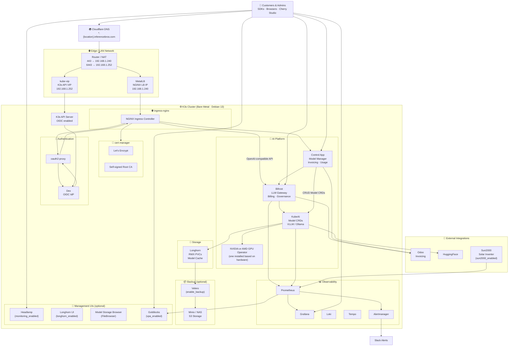

# inference-bros

A Kubernetes-based platform for selling AI inference services. This infrastructure runs on bare-metal servers and deploys language models that customers can access via API.

## 1. Purpose

This platform allows you to:
- Deploy and serve AI language models (like Qwen, Llama, etc.) on your own hardware
- Manage customer access and billing through Bifrost gateway
- Monitor usage and generate invoices automatically via Odoo integration
- Provide OpenAI-compatible API endpoints for easy integration

## 2. Hardware Requirements

### Production/Staging Servers
- **Operating System:** Debian 13 (Trixie)
- **Access:** Root SSH access with your public key already trusted
- **GPU Drivers:** Pre-installed (if using GPUs for model inference)
- **Networking:** Static IPs configured on same LAN
- **Minimum Servers:** 1 or more (3+ recommended for HA)
- **Software:** NAS S3 server or another PC with Minio installed - for offsite backup. Central server, all locations will back up here.

### Network IP Requirements
You'll need at least 2 free IPs on your LAN subnet:
- **kube_vip IP** - Virtual IP for high-availability Kubernetes API (e.g., 192.168.1.252)
- **MetalLB NGINX IP** - LoadBalancer IP for all web services (e.g., 192.168.1.240)

**IP Explanation:**
- **Server IPs** - Each physical server's static IP on your LAN
- **kube_vip** - Floats between master nodes for K3s API redundancy
- **MetalLB NGINX** - Single IP where all ingress traffic lands (Grafana, Bifrost, etc.)

### Public Access (Production)
For production deployments, you need a public IP with port forwarding:
- SSH (2201, 2202, etc. → server port 22)
- HTTPS (443 → MetalLB NGINX IP)
- K3s API (6443 → kube_vip IP)
- Minio (9000-9001 -> NAS port 9000-9001) for backups

### GPU Installation Notes
**NVIDIA on Debian:**
https://github.com/mexersus/debian-nvidia-drivers

For older cards (1050Ti): https://us.download.nvidia.com/XFree86/Linux-x86_64/580.126.09/NVIDIA-Linux-x86_64-580.126.09.run

## 3. Installed Software & Links

### Software Stack

**Core Infrastructure:**
- **K3s** - Lightweight Kubernetes distribution
- **Kube-VIP** - High availability for K3s masters
- **MetalLB** - LoadBalancer services for bare-metal
- **Longhorn** - Persistent volume management (optional, `longhorn_enabled`; required for model caching)
- **System Upgrade Controller** - Automated K3s node upgrades

**Networking & Security:**
- **ingress-nginx** - HTTP(S) routing and load balancing
- **cert-manager** - SSL certificates (Let's Encrypt in production, self-signed CA locally)
- **Dex** - Identity provider (OIDC authentication)
- **oauth2-proxy** - Authentication proxy for internal UIs

**AI & Gateway:**
- **KubeAI** - Model serving orchestration (VLLM, Ollama, FasterWhisper, Infinity runners)
- **Bifrost** - LLM gateway with billing, governance, and customer management
- **NVIDIA GPU Operator** - Installed when `kubeai_compute_processor = "nvidia"`
- **AMD GPU Operator** - Installed when `kubeai_compute_processor = "amd"`

**Monitoring Stack** (optional, `monitoring_enabled`)**:**
- **Prometheus + kube-prometheus-stack** - Metrics collection and storage
- **Grafana** - Monitoring dashboards and visualization
- **Loki** - Log aggregation
- **Fluent Bit** - Log shipping to Loki
- **Tempo** - Distributed tracing
- **Alertmanager** - Alert routing to Slack
- **Headlamp** - Kubernetes dashboard (deployed with monitoring stack)

**Backup** (optional, `enable_backup`)**:**
- **Velero** - Cluster backup and restore
- **Snapshot Controller** - CSI volume snapshots (used with Longhorn)

**Management UIs:**
- **Longhorn UI** - Storage management interface
- **Model Storage Browser** - Browse and manage model cache files (FileBrowser)
- **Goldilocks** - Resource rightsizing recommendations (optional, `vpa_enabled`)

**Custom Integrations** (optional)**:**
- **Sun2000** - Huawei solar inverter monitoring; exports metrics to Prometheus with a pre-built Grafana dashboard (`sun2000_enabled`)

### Service URLs & Access

**Live Deployments (Stalpeni Example):**

All services follow the pattern: `https://{service}.{location}.inferencebros.com`

- `k3s.stalpeni.inferencebros.com:6443` - Kubernetes API
- `dex.stalpeni.inferencebros.com` - Identity provider (OIDC)
- `oauth2-proxy.stalpeni.inferencebros.com` - Authentication proxy
- `headlamp.stalpeni.inferencebros.com` - Kubernetes management dashboard
- `grafana.stalpeni.inferencebros.com` - Monitoring & dashboards
- `prometheus.stalpeni.inferencebros.com` - Metrics collection
- `alertmanager.stalpeni.inferencebros.com` - Alert management
- `longhorn.stalpeni.inferencebros.com` - Storage management
- `bifrost.stalpeni.inferencebros.com` - LLM gateway & customer management
- `models.stalpeni.inferencebros.com` - Model storage browser (FileBrowser)
- `control.stalpeni.inferencebros.com` - Invoicing & usage API
- `goldilocks.stalpeni.inferencebros.com` - Resource rightsizing recommendations

**Available Locations:**
- **local** - Development environment
- **stalpeni** - Production environment in Romania
- **pr** - Preview/staging environment

Each location is completely independent with its own domain, user accounts, customer database, billing, and model deployments.

## 4. How to Use

### Connecting to the Cluster

Before you can deploy models or manage the platform, you need to connect to the K3s cluster. There are several ways to do this:

**Option 1: Use Hosted Headlamp (Easiest)**
- Navigate to `https://headlamp.{location}.inferencebros.com`
- Authenticate via Dex/OAuth2
- Manage resources directly in the web UI

**Option 2: Local kubectl Access**

1. **Get the kubeconfig:**
   - Go to https://app.terraform.io/app/inference-bros/workspaces
   - Select your workspace → Latest State → View
   - Copy `k3s_kubeconfig_for_users` from the JSON
   
2. **Save the kubeconfig:**
   ```bash
   # Save to default location
   mkdir -p ~/.kube
   # Paste the kubeconfig content to ~/.kube/config
   ```

3. **Install required tools:**
   - **kubectl:** Kubernetes command-line tool
   - **int128/kubelogin:** OIDC authentication plugin
     - Download from: https://github.com/int128/kubelogin/releases
     - Rename executable to `kubectl-oidc_login`
     - Place in your PATH (e.g., `/usr/local/bin/`)

4. **Install a cluster management tool (optional):**
   - **Lens (Freelens):** Desktop Kubernetes IDE - https://k8slens.dev/
   - **k9s:** Terminal-based cluster manager - https://k9scli.io/

5. **Test your connection:**
   ```bash
   kubectl get nodes
   # This will trigger OIDC login via browser
   ```

### Deploying Models

Use the **Control app** at `https://control.{location}.inferencebros.com` to manage KubeAI Model CRDs. Navigate to the **Models** tab to create, edit, or delete models. The form handles all required fields including the `openrouter.ai/json` annotation automatically — no YAML editing required.

**Supported Model Runners:**
- **VLLM** - Recommended for production (supports model caching with Longhorn)
- **Ollama** - Alternative runner

**Available Resource Profiles** are loaded dynamically from the `kubeai-config` ConfigMap and displayed in the Control app form. All profiles currently provisioned in this stack:

CPU:
- `cpu` - Generic CPU with baseline resource requests (1 CPU, 2Gi RAM)
- `cpu-unlimited` - Generic CPU, no resource limits
- `cpu-avx2-unlimited` - CPUs with AVX2 support, no resource limits

NVIDIA (modern):
- `nvidia-unlimited` - Any NVIDIA GPU, no resource limits
- `nvidia-gpu-h100` - NVIDIA H100
- `nvidia-gpu-a100-80gb` - NVIDIA A100 80GB
- `nvidia-gpu-a100-40gb` - NVIDIA A100 40GB
- `nvidia-gpu-l40s` - NVIDIA L40S
- `nvidia-gpu-l4` - NVIDIA L4
- `nvidia-gpu-gh200` - NVIDIA GH200
- `nvidia-gpu-a16` - NVIDIA A16
- `nvidia-gpu-t4` - NVIDIA T4
- `nvidia-gpu-rtx4070-8gb` - NVIDIA RTX 4070 8GB

NVIDIA (older):
- `nvidia-older-unlimited` - Pascal-architecture GPUs (GTX 10xx series), no resource limits

AMD:
- `amd-unlimited` - Any AMD GPU, no resource limits
- `amd-gpu-mi300x` - AMD MI300X

**Important Notes:**
- Model caching (Cache Profile) is only supported with VLLM and requires Longhorn
- The `openrouter.slug` and `created` timestamp are computed automatically by the Control app
- KubeAI CRD reference: [kubeai.org/v1 Model spec](https://github.com/kubeai-project/kubeai/blob/main/docs/reference/kubernetes-api.md)

**Example - LLaMA 3.2 1B Instruct:**
```
apiVersion: kubeai.org/v1
kind: Model
metadata:
  annotations:
    openrouter.ai/json: |-
      {
        "id": "qwen2-5-3b-instruct",
        "name": "qwen2-5-3b-instruct",
        "created": 1690502400,
        "input_modalities": ["text"],
        "output_modalities": ["text"],
        "quantization": "gptq-int4",
        "context_length": 1024,
        "max_output_length": 1024,
        "pricing": {
          "prompt": "0.000000027",
          "completion": "0.000000198",
          "image": "0",
          "file": "0",
          "video": "0",
          "audio": "0",
          "request": "0",
          "input_cache_read": "0",
          "input_cache_write": "0"
        },
        "supported_sampling_parameters": ["temperature", "stop"],
        "supported_features": ["tools", "json_mode", "structured_outputs"],
        "description": "Qwen2.5 3B Instruct GPTQ Int4",
        "openrouter": {
          "slug": "inferencebros-stalpeni/qwen2-5-3b-instruct"
        },
        "datacenters": [{"country_code": "RO"}],
        "hugging_face_id": "qwen2-5-3b-instruct"
      }
  name: qwen2-5-3b-instruct
  namespace: kubeai
spec:
  args:
    - '--gpu-memory-utilization=0.95'
    - '--max-model-len=1024'
    - '--enforce-eager'
    - '--max-num-seqs=1'
    - '--enable-auto-tool-choice'
    - '--tool-call-parser=hermes'
  cacheProfile: storage
  engine: VLLM
  features:
    - TextGeneration
  maxReplicas: 1
  minReplicas: 1
  resourceProfile: nvidia-older-unlimited:1
  url: hf://Qwen/Qwen2.5-3B-Instruct-GPTQ-Int4
```
### Customer Management via Bifrost

**Adding New Customers:**

1. Navigate to Bifrost portal: `https://bifrost.{location}.inferencebros.com`
2. Go to **Governance > Users & Groups > Customers**
3. Click **Add Customer** and fill in customer details
4. Navigate to **Governance > Virtual Keys**
5. Click **Create New Key**:
   - Link it to the customer you just created
   - Copy the generated API key for the customer

**Testing Customer Access with Cherry Studio:**

1. Install **Cherry Studio**: https://www.cherry-ai.com/download
2. Open Cherry Studio and navigate to **Settings > Model Provider**
3. Disable all existing providers
4. Click **Add New Provider**:
   - Type: `openai`
   - URL: `https://bifrost.{location}.inferencebros.com`. For local it should be `http://bifrost-insecure.local.inferencebros.com`.
   - API Key: Paste the key from Bifrost
5. Click **Manage Models** and select available models
6. Start chatting to test the deployment!

### Resource Optimization with Goldilocks

**Accessing Goldilocks:**
- Navigate to `https://goldilocks.{location}.inferencebros.com`
- Authenticate via Dex/OAuth2

### Control App

The Control app at `control.{location}.inferencebros.com` is the primary management interface for the platform. It provides a web UI and REST API.

**Web UI Tabs:**
- **Run Invoicing** - Trigger manual billing runs with dry-run support
- **Pricing Sheet** - View current per-token pricing fetched from model annotations
- **Usage Stats** - Query per-API-key usage for any date range
- **OpenRouter JSON** - Raw OpenRouter-format model list from the cluster
- **Models** - Visual KubeAI Model CRD manager (create, edit, delete models)

**Public API Endpoints:**
- `GET /openrouter/models` - OpenRouter-format model list with pricing
- `GET /bifrost/pricingSheet` - Pricing data for Bifrost auto-sync
- `GET /api/models` - List all KubeAI Model CRDs (form-friendly format)
- `GET /api/resource-profiles` - Available resource profiles from `kubeai-config` ConfigMap

**Authenticated Endpoints** (require API key in `Authorization: Bearer` header):
- `GET /usage?start_date=<ISO>&end_date=<ISO>` - Usage statistics for a date range

**Admin Endpoints** (protected by oauth2-proxy):
- `GET /invoicing/generate?date=<ISO>&dry_run=<all|validate|none>` - Manual invoice generation
  - `dry_run=all` - Skip all Odoo operations (test mode)
  - `dry_run=validate` - Check for duplicate invoices only
  - `dry_run=none` - Full run with Odoo sync (default)
- `POST /api/models` - Create a new KubeAI Model CRD
- `PUT /api/models/:name` - Update an existing Model CRD
- `DELETE /api/models/:name` - Delete a Model CRD

**Automatic Invoicing:**
- Runs automatically on the 2nd of each month at 00:00 UTC
- Bills for the previous complete calendar month
- Automatically syncs invoices to Odoo

### Monitoring & Alerts

**Grafana Dashboard:**
- Access: `https://grafana.{location}.inferencebros.com`
- Pre-configured dashboards for:
  - Model inference metrics (requests/sec, latency, tokens/sec)
  - GPU utilization and memory
  - Customer usage patterns
  - Billing and revenue tracking
  - Kubernetes cluster health

**Bifrost Portal Monitoring:**
- Access: `https://bifrost.{location}.inferencebros.com`
- Real-time customer usage
- API key management and rotation
- Rate limiting and quota monitoring

**AlertManager to Slack:**
- Critical alerts automatically sent to Slack workspace

## 5. How to Develop

### Developer Hardware Requirements

- **Development Machine:** Debian 13 on your LAN (can be a VM with Network mode = bridge)
- **SSH Access:** SSH key from Google Drive added as trusted on dev machine
- **Network:** Same LAN as your development server(s)
- **Local Access:** Ability to edit `/etc/hosts` file

### Developer Software Requirements

- **Terraform:** Latest version
- **VSCode:** Recommended IDE with extensions:
  - HashiCorp Terraform
  - Kubernetes
  - YAML
- **kubectl:** Kubernetes command-line tool
- **Git:** For version control
- **SSH Client:** For server access

### Developer Setup Steps

#### Step 1: Prepare Secret Files
Download `terraform.tfvars` from Google Drive (see section 6: External Accounts) and place it in the repo root directory.

#### Step 2: Configure Development Server
- Ensure your Debian 13 machine has the Google Drive SSH key added as trusted
- Note the machine's static IP address (e.g., 192.168.1.100)
- Update `terraform.tfvars` with:
  - Server IP address
  - kube_vip IP (e.g., 192.168.1.252)
  - MetalLB NGINX IP (e.g., 192.168.1.240)
  - Other network settings for your LAN

#### Step 3: Configure Local DNS
Edit `/etc/hosts` on your development machine:

```
192.168.1.252 k3s.local.inferencebros.com
192.168.1.240 dex.local.inferencebros.com
192.168.1.240 oauth2-proxy.local.inferencebros.com
192.168.1.240 headlamp.local.inferencebros.com
192.168.1.240 grafana.local.inferencebros.com
192.168.1.240 alertmanager.local.inferencebros.com
192.168.1.240 prometheus.local.inferencebros.com
192.168.1.240 longhorn.local.inferencebros.com
192.168.1.240 control.local.inferencebros.com
192.168.1.240 models.local.inferencebros.com
192.168.1.240 bifrost.local.inferencebros.com
192.168.1.240 goldilocks.local.inferencebros.com
```

#### Step 4: Deploy Infrastructure

```bash
cd src/terraform
terraform plan
terraform apply
```

#### Step 5: Get Cluster Access

After deployment, retrieve your kubeconfig:

```bash
terraform output k3s_kubeconfig_for_users
```

Save this kubeconfig to `~/.kube/config` or use with `KUBECONFIG` environment variable. Then follow the "Connecting to the Cluster" instructions in section 4 to install kubectl-oidc_login and test your connection.

## 6. External Accounts & Tools

**Google Drive (Secret Files):**
- https://drive.google.com/drive/folders/1M8WCE3i4FGNXZ1uMWLwcyquWPW4AF9pN
- Contains: `terraform.tfvars`, SSH keys, and other sensitive configuration files

**Terraform Cloud (Infrastructure State):**
- https://app.terraform.io/app/inference-bros/workspaces
- Manages infrastructure state for all environments
- Access workspace state files to retrieve kubeconfig

**CloudFlare (DNS Management):**
- https://dash.cloudflare.com/f159b7db29dec75259ced7d4ad1c4a18/inferencebros.com
- Manages DNS records for `inferencebros.com`
- Configure SSL/TLS settings and subdomain routing

**Slack (Alerts & Notifications):**
- https://inferencebros.slack.com/
- Receives alerts from AlertManager
- Channels for monitoring, incidents, and billing notifications

**Odoo (Invoicing System):**
- https://inferencebros.odoo.com/odoo
- Automated invoice generation and customer billing
- Syncs with Control module for usage-based billing

**Minio (S3 NAS):**
- http://inferencebros-stalpeni.go.ro:9000
- Central backup location

---


## 7. Architecture

```mermaid
flowchart TB
  %% =====================================================
  %% USERS & INTERNET
  %% =====================================================
  USERS["👤 Customers & Admins
SDKs · Browsers · Cherry Studio"]

  CF["🌍 Cloudflare DNS
*.{location}.inferencebros.com"]

  USERS --> CF

  %% =====================================================
  %% EDGE & NETWORK
  %% =====================================================
  subgraph EDGE["🌐 Edge / LAN Network"]
    ROUTER["Router / NAT
443 → 192.168.1.240
6443 → 192.168.1.252"]

    METALLB["MetalLB
NGINX LB IP
192.168.1.240"]

    VIP["kube-vip
K3s API VIP
192.168.1.252"]
  end

  CF --> ROUTER
  ROUTER --> METALLB
  ROUTER --> VIP

  %% =====================================================
  %% KUBERNETES CLUSTER
  %% =====================================================
  subgraph K3S["⚙️ K3s Cluster (Bare Metal · Debian 13)"]
    direction TB

    API["K3s API Server
OIDC enabled"]

    subgraph INGRESS["🌐 ingress-nginx"]
      NGINX["NGINX Ingress Controller"]
    end

    subgraph CERTS["🔐 cert-manager"]
      LE["Let's Encrypt"]
      ROOTCA["Self-signed Root CA"]
    end

    subgraph AUTH["🔑 Authentication"]
      DEX["Dex
OIDC IdP"]
      OAUTH["oauth2-proxy"]
    end

    subgraph AI["🤖 AI Platform"]
      BIFROST["Bifrost
LLM Gateway
Billing · Governance"]
      KUBEAI["KubeAI
Model CRDs
VLLM / Ollama"]
      CONTROL["Control App
Model Manager
Invoicing · Usage"]
      GPU["NVIDIA or AMD GPU Operator
(one installed based on hardware)"]
    end

    subgraph STORAGE["💾 Storage"]
      LONGHORN["Longhorn
RWX PVCs
Model Cache"]
    end

    subgraph OBS["📊 Observability"]
      PROM["Prometheus"]
      GRAFANA["Grafana"]
      LOKI["Loki"]
      TEMPO["Tempo"]
      ALERT["Alertmanager"]
    end

    subgraph BACKUP["📦 Backup (optional)"]
      VELERO["Velero
(enable_backup)"]
      S3["Minio / NAS
S3 Storage"]
    end

    subgraph MGMT["🧩 Management UIs (optional)"]
      HEADLAMP["Headlamp
(monitoring_enabled)"]
      LONGHORN_UI["Longhorn UI
(longhorn_enabled)"]
      PVCX["Model Storage Browser
(FileBrowser)"]
      GOLDILOCKS["Goldilocks
(vpa_enabled)"]
    end
  end

  %% =====================================================
  %% INTERNAL FLOWS
  %% =====================================================
  METALLB --> NGINX
  NGINX --> CERTS
  NGINX --> OAUTH
  OAUTH --> DEX
  DEX --> OAUTH
  OAUTH --> NGINX

  VIP --> API
  API --> DEX

  NGINX -->|OpenAI-compatible API| BIFROST
  NGINX --> CONTROL
  BIFROST --> KUBEAI
  KUBEAI --> GPU
  CONTROL -->|CRUD Model CRDs| KUBEAI
  CONTROL --> BIFROST

  KUBEAI --> LONGHORN
  LONGHORN --> VELERO
  VELERO --> S3

  BIFROST --> PROM
  KUBEAI --> PROM
  PROM --> GRAFANA
  PROM --> ALERT
  PROM --> GOLDILOCKS
  ALERT --> SLACK["Slack Alerts"]

  %% =====================================================
  %% BILLING & INTEGRATIONS
  %% =====================================================
  subgraph EXT["🔗 External Integrations"]
    ODOO["Odoo
Invoicing"]
    HF["HuggingFace"]
    SUN2000["Sun2000
Solar Inverter
(sun2000_enabled)"]
  end

  BIFROST --> ODOO
  CONTROL --> ODOO
  KUBEAI --> HF
  SUN2000 --> PROM

  %% =====================================================
  %% MANAGEMENT ACCESS
  %% =====================================================
  USERS --> HEADLAMP
  USERS --> GRAFANA
  USERS --> BIFROST
  USERS --> CONTROL
  USERS --> GOLDILOCKS

```

---

## 8. Quick Reference

**Model Deployment:** Control UI → Models tab → Add / Edit Model
**Customer Setup:** Bifrost UI → Governance → Customers & Virtual Keys
**Resource Optimization:** Goldilocks UI → Review recommendations → Update resource specs
**Monitoring:** Grafana dashboards + Bifrost portal
**Invoicing:** Automatic monthly or manual via Control UI (Run Invoicing tab)
**Development:** Terraform apply → Get kubeconfig → kubectl/Headlamp
